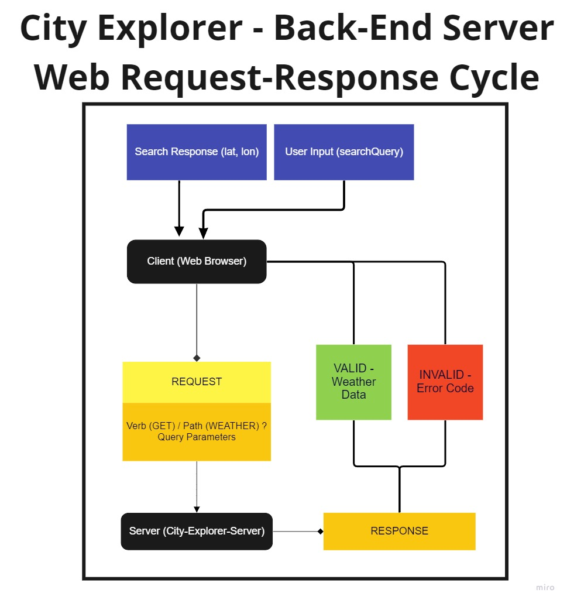
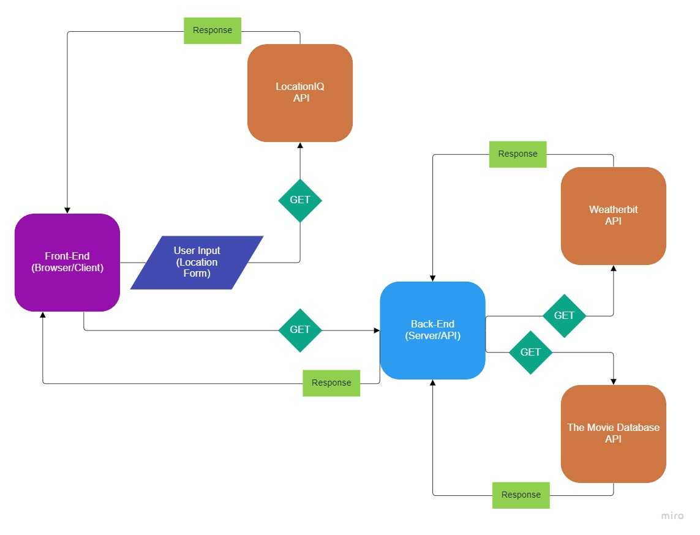
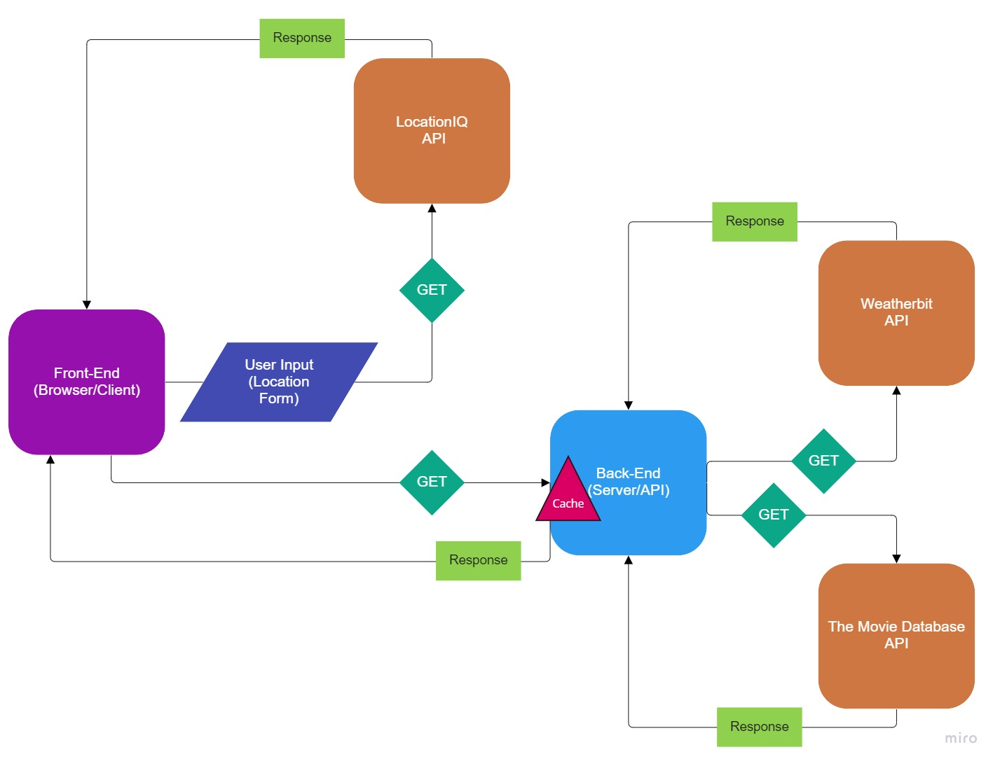

# City Explorer API

**Author**: Robert Shepley  

## Overview

This project acts as the back-end server for my [City Explorer](https://github.com/shepleysound/city-explorer) project.

### [Live Site](https://shepleysound-city-explorer.netlify.app/)

## Architecture
<!-- Provide a detailed description of the application design. What technologies (languages, libraries, etc) you're using, and any other relevant design information. -->
Back-End - [NodeJS](https://nodejs.org/)  
Web Application Framework - [Express](https://expressjs.com/)
External Weather API - [Weatherbit](https://www.weatherbit.io/api)
External Movie Database API - [The Movie Database](https://developers.themoviedb.org/)

This project is the back-end to be used in conjunction with the City Explorer front-end. It receives requests from the client and queries the listed API's, and returns that data back to the front-end to be displayed to the user.

A global cache object detects whether the requested data has been sent to the client within the last hour and does not query the external API's. In future versions, the cache object will handle deleting expired entries.

Back-End Request Response Diagram

### V1

### V2

### V3

## Change Log
<!-- Use this area to document the iterative changes made to your application as each feature is successfully implemented. Use time stamps. Here's an example:
-->

***08-23-2022 3:00pm*** - Application is initialized and ready for development.  

***08-23-2022 5:30PM*** - Application receives requests and sends a response with static data.

***08-23-2022 5:30PM*** - Application receives requests and sends a response using the WeatherBit API.

***08-24-2022 11:00PM*** - Application online. Heroku integration repaired. Will continue monitoring for errors.

***08-25-2022 7:45AM*** - Application sends requests to The Movie Database API.

***08-25-2022 8:30PM*** - Back-End is modularized and successfully communicates with the Front-End.

***08-26-2022 6PM*** - Caching of data implemented.

## Credit and Collaborations
<!-- Give credit (and a link) to other people or resources that helped you build this application. -->

## Time Estimates

### August 23, 2022

| Feature Name | Estimated Time | Start Time | Finish Time |
| ------------ | -------------- | ---------- | ----------- |
| Repository/Project Setup | 30 Minutes | 2:45PM | 3:00PM |
| Documentation Work | 30 Minutes | 3:00PM | 3:45PM |
| Server creation | 1 Hour | 3:45PM | 5:30PM |
| Weather API Request/Response | 1 Hour | 6:30PM | 8PM |

### August 25, 2022

| Feature Name | Estimated Time | Start Time | Finish Time |
| ------------ | -------------- | ---------- | ----------- |
| Movie API Request/Response | Estimated Time | 1 Hour | 7:00AM | 7:45AM |
| Modularize/Refactor | Estimated Time | 2 Hours | 5PM | 7:45PM |

### August 26, 2022

| Feature Name | Estimated Time | Start Time | Finish Time |
| ------------ | -------------- | ---------- | ----------- |
| Data Caching | 2 Hours | 3PM | 6PM